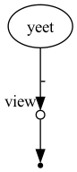

# RENEE_NF

bulk RNA-seq pipeline in Nextflow

[](https://github.com/CCBR/CCBR_NextflowTemplate/actions/workflows/build-nextflow.yml)
[](https://github.com/CCBR/CCBR_NextflowTemplate/actions/workflows/docs-mkdocs.yml)

See the website for detailed information, documentation, and examples:
<https://ccbr.github.io/RENEE_NF/>

## Usage

Install the tool in edit mode:

```sh
pip3 install -e .
```

View CLI options:

```sh
renee_nf --help
```

Navigate to your project directory and initialize required config files:

```sh
renee_nf init
```

Run the example

```sh
nextflow run -profile singularity,biowulf,slurm main.nf \
 --input assets/samplesheet.csv \
 --genome GRCh38_v36 
```

If running outside of biowulf use build option first
```sh
nextflow run -profile singularity main.nf \
 --build \
 --shared_resources <dir to save shared resources> \ # optional
 --genome_fasta /projectnb/wax-es/alecs/renee/GRCh38_GENCODE_v36/GRCh38.p13.genome.fa \
 --genes_gtf /projectnb/wax-es/alecs/renee/GRCh38_GENCODE_v36/gencode.v36.annotation.gtf \
 ```
And then run

```sh
nextflow -c custom_genome.config \ #config created from build mode
 run -profile singularity main.nf \
 --input assets/samplesheet.csv \
 --genome GRCh38_v36 \
 --shared_resources <Shared rescources dir>
```



## Help & Contributing

Come across a **bug**? Open an [issue](https://github.com/CCBR/RENEE_NF/issues) and include a minimal reproducible example.

Have a **question**? Ask it in [discussions](https://github.com/CCBR/RENEE_NF/discussions).

Want to **contribute** to this project? Check out the [contributing guidelines](docs/contributing.md).

## References

This repo was originally generated from the [CCBR Nextflow Template](https://github.com/CCBR/CCBR_NextflowTemplate).
The template takes inspiration from nektool[^1] and the nf-core template.
If you plan to contribute your pipeline to nf-core, don't use this template -- instead follow nf-core's instructions[^2].

[^1]: nektool https://github.com/beardymcjohnface/nektool

[^2]: instructions for nf-core pipelines https://nf-co.re/docs/contributing/tutorials/creating_with_nf_core

[^3]: See also our reusable modules and subworkflows for CCBR nextflow pipelines: <https://github.com/CCBR/nf-modules>
